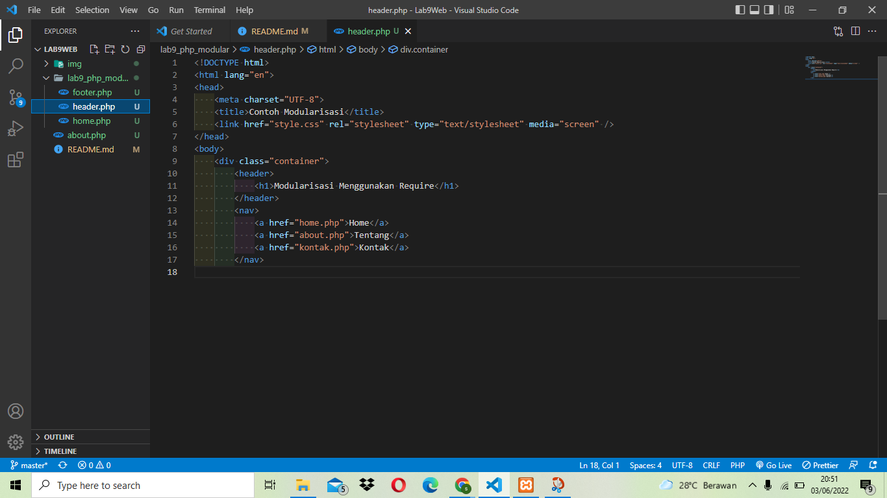
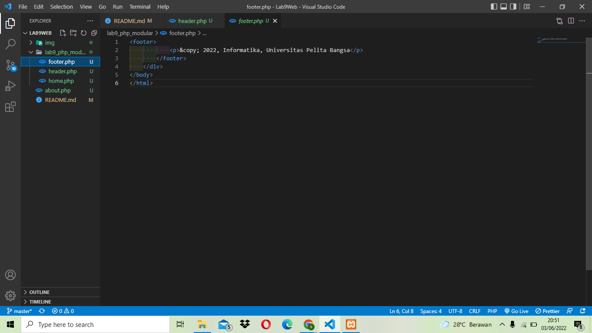
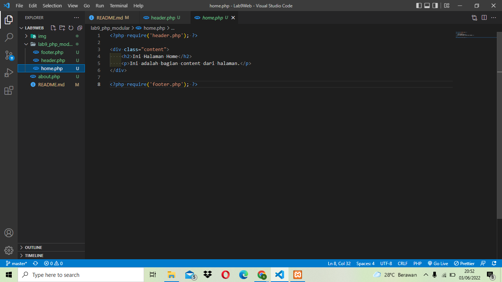
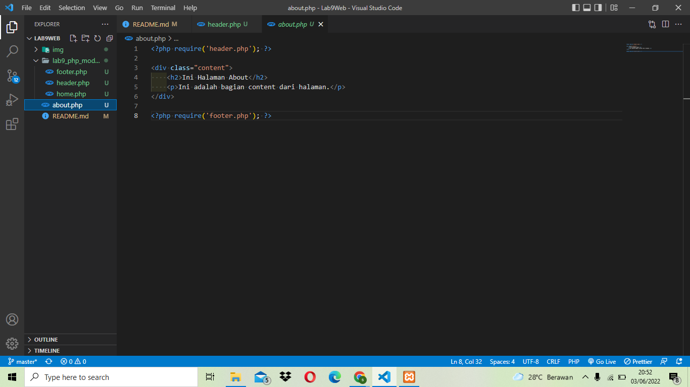

| Nama   | Sardin         |
| ------ | -------------- |
| NIM    | 312010135      |
| Kelas  | TI.20.A1       |
| Matkul | Pemograman Web |

## PERTEMUAN 11

## LAB 9 WEB

## PRAKTIKUM 9

Dipertemuan kali ini kita akan mempelajari php modular

# LANGKAH - LANGKAH PRAKTIKUM

## 1. MENJALANKAN XAMPP SERVER


## 2. BUAT FOLDER BARU DENGAN NAMA lab9_php_modular


Kemudian jalanlan pada localhost server dengan mengakses URL: http://localhost/Lab9Web/lab9_php_modular/


## 3. BUAT FILE BARU DENGAN NAMA header.php


**Code header**

```
<!DOCTYPE html>
<html lang="en">
<head>
   <meta charset="UTF-8">
   <title>Contoh Modularisasi</title>
   <link href="style.css" rel="stylesheet" type="text/stylesheet" media="screen" />
</head>
<body>
   <div class="container">
       <header>
           <h1>Modularisasi Menggunakan Require</h1>
       </header>
       <nav>
           <a href="home.php">Home</a>
           <a href="about.php">Tentang</a>
           <a href="kontak.php">Kontak</a>
       </nav>
```

## 4. BUAT FILE BARU DENGAN NAMA footer.php


**Code footer**

```
<footer>
            <p>&copy; 2022, Informatika, Universitas Pelita Bangsa</p>
        </footer>
    </div>
</body>
</html>
```

## 5. BUAT FILE BARU DENGAN NAMA home.php


**Code home**

```
<?php require('header.php'); ?>

<div class="content">
    <h2>Ini Halaman Home</h2>
    <p>Ini adalah bagian content dari halaman.</p>
</div>

<?php require('footer.php'); ?>
```

## 6. BUAT FILE BARU DENGAN NAMA about.php


**Code about**

```
<?php require('header.php'); ?>

<div class="content">
    <h2>Ini Halaman About</h2>
    <p>Ini adalah bagian content dari halaman.</p>
</div>

<?php require('footer.php'); ?>
```

## 7. TAMPILAN DIBROWSER NYA

Hasilnya seperti ini.


# PERTANYAAN DAN TUGAS
- Implementasikan konsep modularisasi pada kode program praktikum 8 tentang database, sehingga setiap halamannya template tampilan yang sama.
## BUAT FOLDER BARU lab9_tugas
- 
- 
- 
